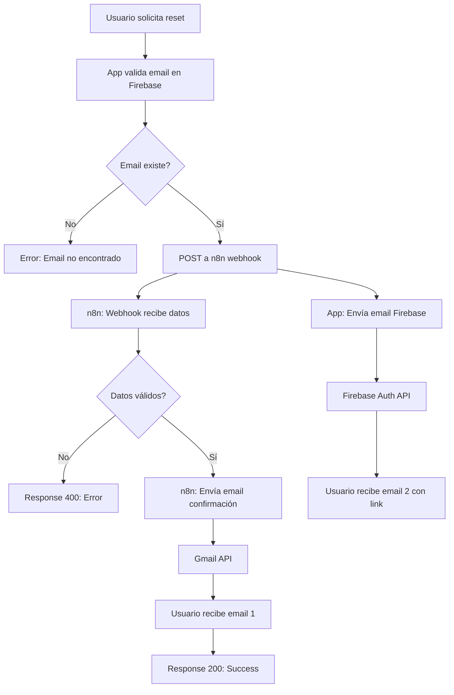
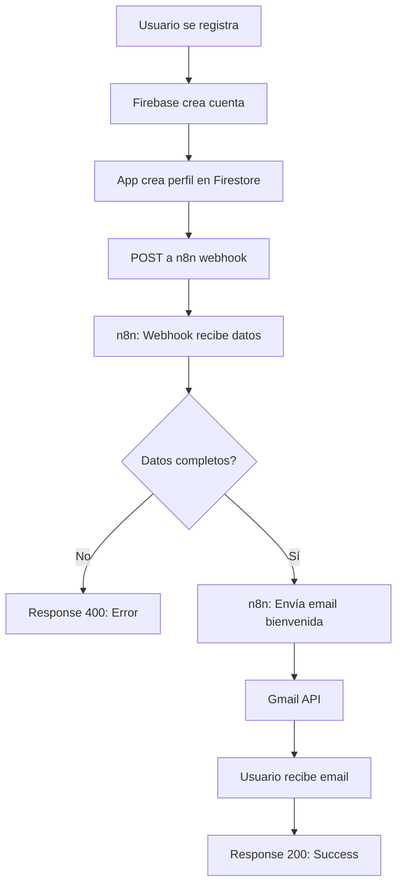

# 🔄 Diagramas de Workflows n8n

## Workflow 1: Password Reset Email



### Estructura del Workflow en n8n

```
┌─────────────────────────────────────────────────────────────────┐
│                    Password Reset Workflow                       │
└─────────────────────────────────────────────────────────────────┘

  [Webhook]                    Recibe POST con { email, timestamp }
      │
      ↓
  [Validate Email]             Verifica que email no esté vacío
      │
      ├── ✓ Email válido
      │     ↓
      │   [Send Email]          Envía correo vía Gmail
      │     ↓
      │   [Success Response]    Return 200 { success: true }
      │
      └── ✗ Email inválido
            ↓
          [Error Response]      Return 400 { success: false }
```

---

## Workflow 2: User Registration Confirmation



### Estructura del Workflow en n8n

```
┌─────────────────────────────────────────────────────────────────┐
│                 User Registration Workflow                       │
└─────────────────────────────────────────────────────────────────┘

  [Webhook]                    Recibe POST con { uid, email, createdAt }
      │
      ↓
  [Validate Data]              Verifica que uid y email existan
      │
      ├── ✓ Datos completos
      │     ↓
      │   [Send Welcome Email]  Envía correo de bienvenida vía Gmail
      │     ↓
      │   [Success Response]    Return 200 { success: true }
      │
      └── ✗ Datos incompletos
            ↓
          [Error Response]      Return 400 { success: false }
```

---

## 📊 Flujo Completo de Comunicación

### Password Reset - Secuencia Detallada

```
┌─────────┐     ┌──────────┐     ┌──────────┐     ┌───────┐     ┌──────────┐
│ Usuario │     │   App    │     │   n8n    │     │ Gmail │     │ Firebase │
└────┬────┘     └────┬─────┘     └────┬─────┘     └───┬───┘     └────┬─────┘
     │               │                 │               │              │
     │ 1. Click      │                 │               │              │
     │  "Olvidé mi   │                 │               │              │
     │   contraseña" │                 │               │              │
     │──────────────>│                 │               │              │
     │               │                 │               │              │
     │               │ 2. fetchSignIn  │               │              │
     │               │    Methods      │               │              │
     │               │────────────────────────────────────────────────>│
     │               │<────────────────────────────────────────────────│
     │               │ 3. Email válido │               │              │
     │               │                 │               │              │
     │               │ 4. POST webhook │               │              │
     │               │─────────────────>│               │              │
     │               │                 │               │              │
     │               │                 │ 5. Send email │              │
     │               │                 │──────────────>│              │
     │               │                 │               │              │
     │               │<────────────────│               │              │
     │               │ 6. Success      │               │              │
     │               │                 │               │              │
     │               │ 7. sendPassword │               │              │
     │               │    ResetEmail   │               │              │
     │               │────────────────────────────────────────────────>│
     │               │                 │               │              │
     │<──────────────────────────────────────────────────────────────────────────┐
     │ 8. Recibe email de confirmación (n8n)          │              │           │
     │<──────────────────────────────────────────────────────────────────────────┘
     │                                                │              │
     │<──────────────────────────────────────────────────────────────────────────┐
     │ 9. Recibe email con link (Firebase)            │              │           │
     │<──────────────────────────────────────────────────────────────────────────┘
```

### User Registration - Secuencia Detallada

```
┌─────────┐     ┌──────────┐     ┌──────────┐     ┌───────┐     ┌──────────┐
│ Usuario │     │   App    │     │   n8n    │     │ Gmail │     │ Firebase │
└────┬────┘     └────┬─────┘     └────┬─────┘     └───┬───┘     └────┬─────┘
     │               │                 │               │              │
     │ 1. Completa   │                 │               │              │
     │    formulario │                 │               │              │
     │    registro   │                 │               │              │
     │──────────────>│                 │               │              │
     │               │                 │               │              │
     │               │ 2. createUser   │               │              │
     │               │────────────────────────────────────────────────>│
     │               │<────────────────────────────────────────────────│
     │               │ 3. Usuario      │               │              │
     │               │    creado       │               │              │
     │               │                 │               │              │
     │               │ 4. setDocument  │               │              │
     │               │    (Firestore)  │               │              │
     │               │────────────────────────────────────────────────>│
     │               │                 │               │              │
     │               │ 5. POST webhook │               │              │
     │               │─────────────────>│               │              │
     │               │                 │               │              │
     │               │                 │ 6. Send email │              │
     │               │                 │──────────────>│              │
     │               │                 │               │              │
     │               │<────────────────│               │              │
     │               │ 7. Success      │               │              │
     │               │                 │               │              │
     │<──────────────────────────────────────────────────────────────────────────┐
     │ 8. Recibe email de bienvenida                  │              │           │
     │<──────────────────────────────────────────────────────────────────────────┘
     │               │                 │               │              │
     │<──────────────│                 │               │              │
     │ 9. Toast:     │                 │               │              │
     │   "Registro   │                 │               │              │
     │    exitoso"   │                 │               │              │
```

---

## 🎯 Puntos Clave

### Password Reset
- ✅ **Doble validación**: Firebase Auth + n8n
- ✅ **Dos emails**: Confirmación (n8n) + Link (Firebase)
- ✅ **Fail-safe**: Si n8n falla, Firebase aún envía el link
- ⏱️ **Timeout**: 30 segundos para webhook de n8n

### User Registration
- ✅ **Notificación instantánea**: Email de bienvenida vía n8n
- ✅ **No bloqueante**: El registro no falla si n8n falla
- ✅ **Trazabilidad**: Logs en n8n de todos los registros
- 🎨 **Personalizado**: Email con diseño de marca

---

## 🔧 Configuración de Timeouts

### En el código (auth-context.tsx)

```typescript
// Timeout para webhooks de n8n
const N8N_TIMEOUT = 30000; // 30 segundos

// Wrapper con timeout
const fetchWithTimeout = async (url, options, timeout = N8N_TIMEOUT) => {
  const controller = new AbortController();
  const id = setTimeout(() => controller.abort(), timeout);
  
  try {
    const response = await fetch(url, {
      ...options,
      signal: controller.signal
    });
    clearTimeout(id);
    return response;
  } catch (error) {
    clearTimeout(id);
    throw error;
  }
};
```

---

## 📈 Métricas y Monitoreo

### En n8n Dashboard

1. **Executions**: Ver todas las ejecuciones
2. **Success Rate**: % de ejecuciones exitosas
3. **Avg Duration**: Tiempo promedio de ejecución
4. **Error Rate**: % de errores

### Alertas Recomendadas

- 🚨 **Error rate > 10%**: Revisar credenciales Gmail
- 🚨 **Avg duration > 10s**: Problemas de red
- 🚨 **0 executions en 24h**: Workflow desactivado o URLs incorrectas

---

## 🎨 Personalización Avanzada

### Agregar más acciones

```
[Send Email]
     ↓
[Add to Mailchimp]    ← Agregar a lista de correo
     ↓
[Notify Slack]        ← Notificar a equipo
     ↓
[Log to Database]     ← Guardar en DB externa
     ↓
[Success Response]
```

### Agregar validaciones

```
[Webhook]
     ↓
[Check Rate Limit]    ← Limitar requests por IP
     ↓
[Validate Email Format] ← Regex validation
     ↓
[Check Blacklist]     ← Lista negra de emails
     ↓
[Send Email]
```
